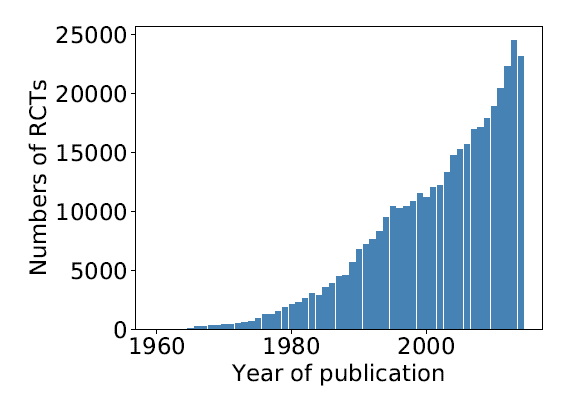
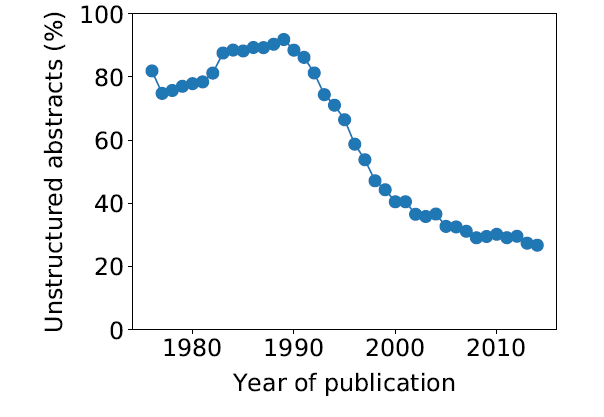
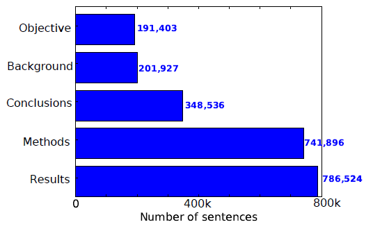
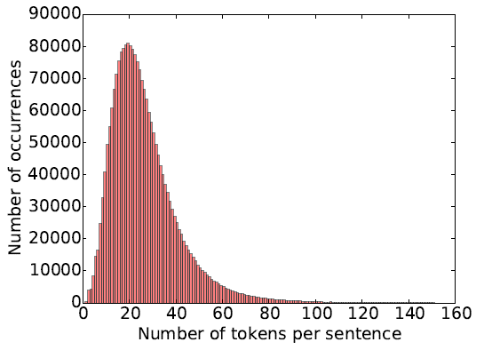
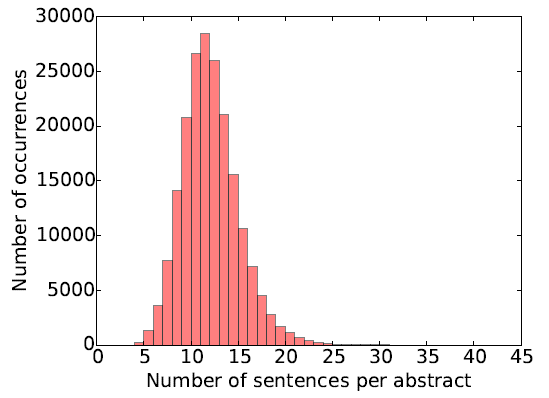

# Multi‑Class Sequential Sentence Classification on PudMed 200k RCT Dataset: Representation Learning
This repository contains representation learning project, particularly sequential sentence classification on PudMed 200k Randomized Clinical Trials dataset.

#### Problem Definition
The researchers in the medical/healthcare domain are in the need of more efficient tools/applications to skim through the abstracts of randomized controlled trials (RCTs) that are published highly unstructured manner.

As depicted in the left figure, the number of published RTCs increases every year, resulting challenging review process for the medical community to distil the information that they are searching for. This process is much easier when abstracts are structured, i.e., the text information in an abstract is divided into semantic sections such as objective, method, result, and conclusion. Yet, over half of published RCT abstracts are unstructured, as shown in right figure, which makes it more difficult to quickly access the information of interest.

<figcaption>

*Left*: Number of RCTs present in PubMed published yearly between 1960 and 2014.
*Right:* Evolution of the percentage of RCT abstracts present in PubMed that are unstructured between 1975 and 2014.
</figcaption>

#### Goal
The fundamental goal of this project is to classify the sequential sentences included in the abstracts of RCTs into background, objective, method, result, conclusion category such that backbone of the possible AI tool for automatically skimming unstructured RTCs is obtained.

#### Dataset
PubMed 200k RCT - dataset based on PubMed for sequential sentence classification. The dataset consists of approximately 200,000 abstracts of RTCs, totaling 2.3 million sentences.

Here are the brief descriptive statistics about the PubMed 200k RTC dataset:

<figcaption>

*Left:* Number of sentences w.r.t class labels.
*Middle:* Distribution of the number of tokens the sentence. Minimum: 1; mean: 26.2; maximum: 338; variance: 227.6; skewness: 2.0; kurtosis: 8.7.
*Right:* Distribution of the number of sentences per abstract. Minimum: 3; mean: 11.6; maximum: 51; variance: 9.5; skewness: 0.9; kurtosis: 2.6..</figcaption>

#### Labels and Performance Metric
Ground truth labels are divided into five categories: background, objective, method, result, and conclusion. The Evaluation metric is identified as the F1-score.

#### Project Steps
1. Conduct preprocessing: Lowercasing, stop-word removal, replacing the digits with special tokens and punctuation removal.
2. Develop Baseline model: TF-IDF + Logistic Regression combination.
3. Develop Word2Vec Model: Using gensim library.
4. Developing LSTM/ GRU models for the text classification.

### Respiratory Structure
- `project_notebook.ipynb`:A Jupyter notebook that includes project steps taken for the project.
- `models`: Machine learning models' artifacts obtained after project finalization.
- `figures`: The plots.
- `datasets`: A directory containing PubMed 200k RTC dataset. Not included in the repository due to online data availability.

### Results and Discussion
Below is the table demonstrating models, their parameters, architecture details, training methodologies, accuracies and weighted F1-scores.

| Models | Embedding Output Size | Bidirectional |# RNN Units | Dropout| Learning Rate | Optimizer | Batch Size | # of epochs | Accuracy* |Weighted F1 Score*|
|:---:|:-------------:|:-----------:|:-----------:|:-------------:|:-----------:|:-----------:|:-----------:|:-----------:|:-----------:|:-----------:|
|LSTM (Vanilla) |10|-|10|-| 0.0001| adam| 2000| 10|0.348|0.180|
|LSTM           |100|one|10|-|0.0001| adam| 2000|20|0.801|0.798|
|LSTM           |20|double|10-10|0.2|0.0001| adam|2000|20|0.790|0.788|
|LSTM           |10|double|60-60|0.5|0.001| adam|2000|5|0.807|0.804|
|LSTM          |10|double|50-10|0.5|0.001|RMSprop|1000|10|0.825|0.823|
|LSTM          |10|double|50-10 + dropout|0.5|0.001|RMSprop|1000|15|**0.830**|**0.828**|
|-----------|-----------|-----------|-----------|-----------|-----------| ------------|------------|------------|------------|------------|
|GRU (Vanilla) |10|-|10|-| 0.0001| adam| 2000| 20| 0.345| 0.178|
|GRU           |10|one|10|-| 0.0001| adam| 2000| 10| 0.780| 0.775|
|GRU           |10|one|10|-| 0.0001| adam| 2000| 20| 0.863| 0.824|

*Model performances depicted obtained on the test set.*

In this project, we developed multiple deep learning models, LSTM and GRU models, with differing model parameters and architectures and evaluated the model performances. What we observe is that the output dimension of the embedding layer plays a key role however, it introduces the number of model parameters and training time greatly.

Secondly, bidirectionality is a game-changer factor in our models. Once it is introduced, RNN units are able to preserve information from past and future states, thus capturing dependencies within sequences and learning over training dataset.

Specifically, we observe that introducing Dropout layer after Dense Layer as well as within Bidirectional LSTM allowed our model to perform the best. Additionally, creating a Bidirectional bottleneck by double LSTM units with the size of 50 and 10 distils the crucial states to pass through the network, resulting the best model performance.

### Main Challenges and Future Work

From NLP point of view, it is difficult to obtain well-represented domain-specific embeddings, in our case healthcare domain. Additionally, we haven't used any pre-trained model such as BioBert to head start with robust word representations.

As future action, one can experiment with different word embedding models such as Glove and Doc2Vec. In this project, we treat each sequence separately and extract features from word level. One can extend this approach with feeding series of sequences each time, thus enforcing model to treat the series as documents and capture relationships among them.

Additionally, one can extend the proposed architectures with deeper RNN models, and explore different optimizers and learning rates, batch sizes, vocabulary sizes, Ngram approaches, and all the other parameters that are not mentioned.

### Acknowledgements
The graphs are included in this README file: *Source: [PubMed 200k RCT: a Dataset for Sequential Sentence Classification in Medical Abstracts](https://aclanthology.org/I17-2052) (Dernoncourt & Lee, IJCNLP 2017)*

### License
This work is licensed under MIT License, however, it is subject to repository-owner approval and permission for public and private usage.
